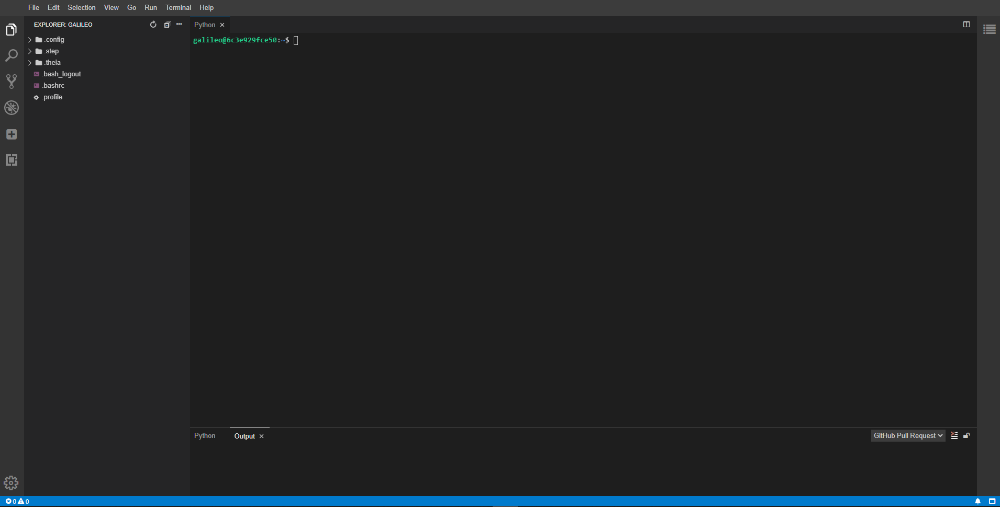

# Galileo IDE

The [Galileo](https://hypernetlabs.io/galileo/) IDE is based on the [Theia project](https://theia-ide.org/).
Components are added via dependencies in package.json. Additional functionality can be added plugins which can
be specified at build-time via package.json or added during an active user session through the plugin manager.

The build environment is currently based on the [ubuntu:18.04](https://hub.docker.com/_/ubuntu)
base image.

## Build

To build a local version of the IDE, first uncomment the basic authentication commands at
the bottom of the Dockerfile. Then run the following command in the root of the project:

`docker build -t galileo-ide .`
