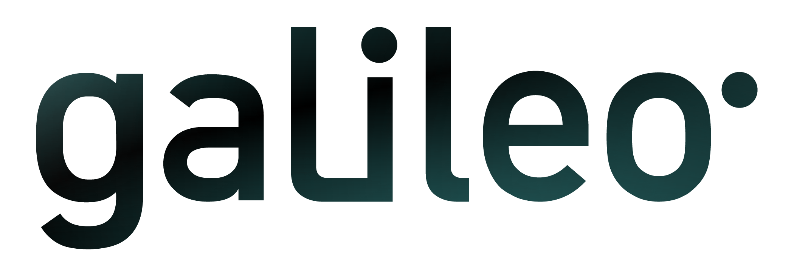

# Galileo IDE

The [Galileo](https://hypernetlabs.io/galileo/) IDE is based on the [Theia project](https://theia-ide.org/).
Components are added via dependencies in package.json. Additional functionality can be added plugins which can
be specified at build-time via package.json or added during an active user session through the plugin manager. 

The container runtime is currently built on top of the [continuumio/miniconda3](https://hub.docker.com/r/continuumio/miniconda3)
base image. 

The Galileo IDE provides authentication and reverse proxy functionality 
via [Caddy 2](https://caddyserver.com/docs/) and uses supervisord for 
the startup sequence. 

Additional reverse-proxy ports can be added to the Caddyfile. 

## Build

To build a local version of the IDE, first uncomment the basic authentication commands at 
the bottom of the Dockerfile. Then run the following command in the root of the project:

`docker build -t galileo-ide .`

## Run

To launch an instance of the IDE, run:

`docker run -d --rm --name galileo-ide -p 8888:8888 galileo-ide`

Then open a webbrowser to http://127.0.0.1:8888. The username and password will be
whatever is specified in the Dockerfile for the environment variables USERNAME and
PASSWORD (i.e. myuser and testpass2 by default). 

## Stop

To stop the IDE, run:

`docker kill galileo-ide`

## TODO: 
- custom preview page (via @theia/preview dependency)
- extensible reverse proxy options
- working directory configuration
